# AWS構成設計

このアプリケーションを AWS 上で動かすための構成を定める。
利用者からの窓口を CloudFront に一本化する。

> **現在の状態**: 設計のみ。`infra/` に Terraform のコードはまだ無く、デプロイもしていない。
> 本書は実装前の設計書であり、「動いた記録」ではない。デプロイ後に実測結果を追記する。

前提として、この構成は**学習目的**である。可用性よりコストを優先した箇所が複数あり、
そのすべてを「学習用の割り切り」の節に列挙する。

## 構成図

```mermaid
flowchart TD
    U["ブラウザ（利用者）"] -->|HTTPS| CF

    subgraph CFD["CloudFront ─ dxxxx.cloudfront.net（唯一の窓口）"]
      direction LR
      CF{{"ビヘイビア振り分け"}}
      B2["default<br/>S3 静的オリジン・OAC"]
      B3["/images&#42;<br/>S3 画像オリジン・OAC<br/>署名付き Cookie"]
      B1["/api&#42;<br/>ALB オリジン<br/>CachingDisabled"]
      CF --> B2
      CF --> B3
      CF --> B1
    end

    B2 --> S3F[("S3 静的サイトバケット<br/>frontend/build・完全非公開")]
    B3 --> S3I[("S3 画像バケット<br/>完全非公開")]
    B1 -->|"HTTP:80<br/>＋シークレットヘッダー"| ALB

    subgraph VPC["VPC 10.0.0.0/16"]
      direction TB
      subgraph PUB["public subnet ×2AZ（NAT なし）"]
        ALB["ALB internet-facing<br/>CloudFront 以外は 403"]
        ECS["ECS Service / Fargate<br/>backend:8080<br/>0.5vCPU/1GB・desired 2"]
        ALB -->|"TG :8080<br/>HC /api/livez"| ECS
      end
      subgraph PRI["private subnet ×2AZ"]
        RDS[("RDS MySQL 8.4<br/>db.t4g.small / gp3<br/>Single-AZ・非公開")]
      end
      ECS -->|":3306"| RDS
    end

    S3I -->|"PutObject イベント"| LMB["Lambda（Go）<br/>検証・EXIF除去・変換"]
    LMB --> S3I
    LMB --> RDS

    U -.->|"アップロードのみ<br/>presigned PUT で直接"| S3I
    ECS -->|"IGW 経由"| EXT["ECR / SSM Parameter Store"]
```

## キャッシュ方針

| 経路 | ポリシー | キャッシュ |
|---|---|---|
| default（静的サイト） | `CachingOptimized` | **する**。Vite の出力はファイル名にハッシュが付くため長期キャッシュして安全。`index.html` のみ `no-cache` を付け、デプロイ時に invalidate する |
| `/images/*` | `CachingOptimized` | **する**。URL が `/images/<key>` で固定のため、エッジもブラウザも効く |
| `/api/*` | `CachingDisabled` | **しない（意図的）** |

**`/api/*` をキャッシュしないのは性能上の妥協ではなく安全性の判断である。**
このAPIはアクセストークンで認証しており、レスポンスが閲覧者ごとに異なる
（フィードの `isLiked`、フォロー中フィード、通知の未読数）。
CDN でキャッシュすると、ある利用者向けのレスポンスが別の利用者に配られる事故になる。
利用者単位でキャッシュキーを分ける方法もあるが、ヒット率がほぼ出ないうえ
設定を誤ったときの被害が大きいため採らない。

API レスポンスの転送量削減は CDN ではなく gzip 圧縮で行う。

## 設計判断

### 1. 単一ドメイン方式にする

CloudFront を1つだけ作り、静的ファイル・API・画像のすべてを同じドメインから配信する。
ブラウザから見て同一オリジンになるため、次が同時に解決する。

- CORS の設定が実質不要になる
- リフレッシュトークンの Cookie がクロスサイトにならず、`SameSite=Strict` のまま素直に飛ぶ
- 独自ドメインと ACM 証明書を用意せずに済む（CloudFront の既定ドメインで完結する）

分離方式（API は ALB を直接叩く）を採ると、`SameSite=None; Secure` が必須になり、
さらに ALB 用の独自ドメインと証明書が必要になる。

### 2. ALB はインターネット向けにしつつ、CloudFront 以外を弾く

CloudFront の既定ドメインのみを使う構成では VPC オリジン機能や内部 ALB は利用できないため、
ALB は internet-facing にせざるを得ない。そのままでは利用者が ALB の DNS 名を
直接叩けてしまい、「CloudFront を唯一の窓口にする」前提が崩れる。二重に絞る。

1. **セキュリティグループのインバウンドを CloudFront のマネージドプレフィックスリストに限定する。**
   ただしこれは「CloudFront から来たこと」しか保証しない。他人が作った
   ディストリビューションも同じ IP レンジから来るため、これだけでは不十分である
2. **CloudFront が付与するカスタムオリジンヘッダーの値をリスナールールの条件にし、
   デフォルトアクションを403の固定レスポンスにする。** こちらが実際の防御線になる

### 3. Fargate をパブリックサブネットに置く

タスクをプライベートサブネットに置くと、ECR からのイメージ取得と
SSM Parameter Store からの秘密取得のために NAT ゲートウェイ（月$35前後の常時課金）か
複数の VPC エンドポイントが必要になる。学習用途では割に合わない。

パブリック IP は付与されるが、セキュリティグループのインバウンドを
ALB からの :8080 のみに絞るため外部からは到達できない。
**この妥協はアプリケーション層に限定し、RDS は IGW へのルートを持たない
プライベートサブネットに置く。**

### 4. ヘルスチェックを livez と readyz に分ける

ALB のターゲットグループには **`/api/livez`（データベースを見ない）** を向ける。

前回プロジェクトでは単一の `/api/health` がデータベース疎通まで見ていたため、
「RDS が一時的に不調 → 全タスクが unhealthy → 全置換」が走る構造だった。
置き換えても RDS は回復しないため、状況が悪化するだけである。
タスクを入れ替えるべき理由になるのは「プロセスが生きていないこと」だけである。

`/api/readyz` はデプロイ時の投入判定と運用中の状況確認に使う。

### 5. 画像処理を S3 イベント駆動の Lambda で行う

アップロードはブラウザから S3 へ直接送る（バックエンドの帯域とタイムアウトを消費しないため）。
その結果、**バックエンドはファイルの中身を一度も見ない**。検証と加工は
S3 の `PutObject` イベントで起動する Lambda が担う。

| 処理 | 目的 |
|---|---|
| マジックバイト検証 | 拡張子や申告された Content-Type を信用しない |
| 寸法・サイズの上限確認 | 極端に大きい画像で後段が詰まるのを防ぐ |
| **再エンコードによる EXIF の全除去** | **GPS 座標・撮影日時・端末情報を落とす** |
| variants 生成（thumb 320 / medium 1080） | 一覧で原本を配らない |

**処理が成功したメディアだけが投稿として公開できる。**
「Lambda が落ちたが投稿は公開され、GPS 入りの原本が配信される」経路を構造的に作らない。

Lambda のランタイムは Go とし、バックエンドと言語を統一する。
Go の標準 `image` パッケージで再デコード・再エンコードすれば EXIF は自然に落ちる。

### 6. 確定しなかったアップロードをライフサイクルで削除する

署名付き URL を発行してからブラウザが閉じられると、S3 に誰も参照しないオブジェクトが残る。
`media.status` を `pending` として先に記録しておくことで後から特定できるが、
S3 側にも**接頭辞 `originals/` に対する期限削除のライフサイクルルール**を設定し、
一定期間で確実に消えるようにする。

### 7. Terraform の state はローカル管理のまま

前回プロジェクトの判断を維持する。今回のスコープを構成の構築に絞るため、
state 管理方式の変更は同時に行わない。
チーム開発や環境の永続化を考える段階になったら S3 バックエンド化を検討する。

## 設定値

### ネットワーク

| 項目 | 値 |
|---|---|
| VPC CIDR | `10.0.0.0/16` |
| public subnet | `10.0.0.0/24`(AZ-a) / `10.0.1.0/24`(AZ-c) |
| private subnet | `10.0.10.0/24`(AZ-a) / `10.0.11.0/24`(AZ-c) |
| インターネットゲートウェイ | あり（public のルートテーブルのみ `0.0.0.0/0` を向ける） |
| NAT ゲートウェイ | **なし** |
| ALB の SG | CloudFront のマネージドプレフィックスリストから :80 のみ |
| ECS タスクの SG | ALB の SG から :8080 のみ |
| RDS の SG | ECS タスクの SG から :3306 のみ |

ALB と RDS サブネットグループはどちらも2AZ以上を要求するため、サブネットは最低2AZ分用意する。

### ECS / Fargate

| 項目 | 値 |
|---|---|
| CPU / メモリ | **0.5 vCPU / 1GB** |
| desired count | **2** |
| デプロイ | circuit breaker 有効 + 自動ロールバック有効 |
| ログ | awslogs ドライバ → CloudWatch Logs |

前回は 0.25 vCPU / 512MB × 1 だった。ピーク50 req/s の想定に対し
0.25 vCPU（1/4コア）では不足するため引き上げている。
**この値は出発点であり、負荷試験の実測で上下させる。**

### RDS

| 項目 | 値 |
|---|---|
| エンジン | **MySQL 8.4 LTS** |
| インスタンスクラス | **db.t4g.small** |
| ストレージ | gp3 20GB |
| Multi-AZ | **なし**（学習用の割り切り） |
| パブリックアクセス | 無効 |
| バックアップ保持 | 1日 |
| パラメータ | `ngram_token_size = 2`（ローカルと揃える） |

**接続数の検算**: 「タスク数 × 接続プール上限 ≦ `max_connections`」を確認する。
2タスク × 25 = 50 に対し db.t4g.small の `max_connections` は約225であり成立する。
タスク数を増やす場合はこの式が上限の根拠になる（9タスクで上限に達する）。

> **未確認事項**: RDS for MySQL が 8.4 を提供しているか、`db.t4g.small` で
> 選択できるかは着手時に AWS の一次情報で確認する。提供がない場合は
> Aurora MySQL の 8.4 互換版か、RDS 8.0 + Extended Support かを再判断する。

### 秘密の管理

SSM Parameter Store（SecureString）から注入する。

| 変数 | 内容 |
|---|---|
| `DB_PASSWORD` | Terraform の `random_password` で生成 |
| `JWT_SECRET` | 同上。HS256 の共有鍵 |
| `CDN_PRIVATE_KEY` | CloudFront 署名付き Cookie 用の秘密鍵 |

Secrets Manager ではなく Parameter Store を使うのは、SecureString が無料枠で扱えるためである。
秘密の数が少なく自動ローテーションも不要な学習用途で、
1シークレットあたり月額を払う理由がない。

## 学習用の割り切り

以下は**意図的にコストを優先した箇所**である。本番運用する場合は変更が必要になる。

| 箇所 | 現在の設定 | 本番でどうすべきか |
|---|---|---|
| Fargate の配置 | パブリックサブネット + パブリック IP | プライベートサブネット + NAT ゲートウェイ、または VPC エンドポイント群 |
| NAT ゲートウェイ | なし | 2AZ に配置 |
| RDS の可用性 | Single-AZ | Multi-AZ |
| RDS の削除保護 | 無効 / 最終スナップショットなし | どちらも有効化する |
| RDS のバックアップ | 保持1日 | 要件に応じて7〜35日 |
| ECS タスク数 | 2（固定） | Application Auto Scaling。トリガ指標は ECS タスクの CPU ではなく **RDS の CPU** が適切 |
| ドメイン | CloudFront の既定ドメイン | 独自ドメイン + ACM 証明書(us-east-1) + Route53 |
| WAF | なし | CloudFront に AWS WAF を付ける |
| レート制限 | アプリのメモリ内 | **2タスク構成では厳密に効かない。** ElastiCache か WAF で行う |
| Terraform state | ローカル | S3 バックエンド + ロック |
| CD | 手動デプロイ | GitHub Actions から ECR push / ECS デプロイ / S3 sync |

**レート制限の項目は、割り切りの中でも影響が具体的である。**
アプリのメモリで数える実装は、タスクが2つあると各タスクが独立に数えるため
実効的な上限が2倍になる。ログイン試行の制限としては弱まる。
設計書に明記し、本番運用時には外部ストアへ移す。

## 概算費用

ap-northeast-1、常時起動した場合の月額の目安。

| サービス | 構成 | 概算 |
|---|---|---|
| ALB | 1台 + 最小 LCU | 約 $18 |
| ECS Fargate | 0.5vCPU / 1GB × 2タスク × 730時間 | 約 $36 |
| RDS | db.t4g.small + gp3 20GB | 約 $32 |
| Lambda | 画像処理・少量 | 数ドル未満 |
| S3 / CloudFront / ECR / Parameter Store | 学習用途の少量 | 数ドル |
| **合計** | | **月 $90〜100 程度** |

前回（月$40〜50）より高い。ピーク50 req/s と投稿20万件という想定規模に合わせて
Fargate と RDS を1段階ずつ上げたためである。

**固定費の大半は ALB・Fargate・RDS で、起動しているだけで課金される。**
学習目的で常時稼働させる必要はないため、使わない期間は `terraform destroy` する運用を前提とする。
destroy しても構成は Terraform のコードとして残るため、必要なときに再構築できる。

**負荷試験のデータ量に関する注意**: 投稿20万件を額面どおり画像付きで作ると、
40万メディア × variants 3種 = 120万オブジェクト / 600GB規模となり、
S3 だけで月$15前後の課金が発生する。
**データベースは20万件フルで作り、画像実体は代表的な数十件のみ実物とし、
残りは同一オブジェクトを参照するダミーキーにする。**
索引と結合の性能は正しく測れて、ストレージ課金は発生しない。

## 関連ドキュメント

- [技術スタック](tech-stack.md) — 技術選定とその理由
- [要件定義書](requirements.md) — 非機能要件と想定規模
- [運用設計](operations.md) — ログ・監視・障害対応
