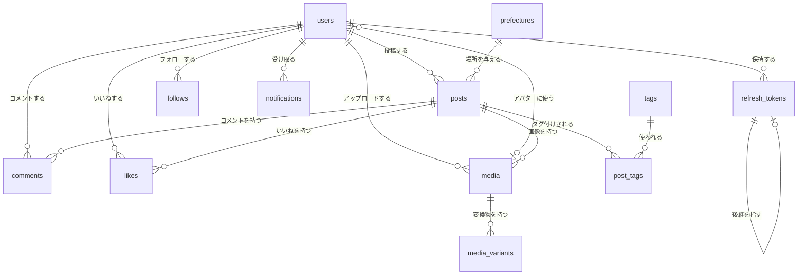

# ER図

全テーブル InnoDB / `utf8mb4` / `utf8mb4_0900_ai_ci`。
主キーは `BIGINT UNSIGNED AUTO_INCREMENT` を既定とし、
`prefectures` のみ外部で定められたコード（JIS X 0401）を主キーにする。

## 全体図



---

## users — 利用者

| 列 | 型 | 制約 | 説明 |
|---|---|---|---|
| `id` | BIGINT UNSIGNED | PK, AI | |
| `handle` | VARCHAR(30) | UNIQUE, NOT NULL | 英数字とアンダースコアのみ。URL に使う識別子 |
| `email` | VARCHAR(255) | UNIQUE, NOT NULL | ログイン ID として使う。**メール送信は行わない** |
| `password_hash` | VARCHAR(255) | NOT NULL | bcrypt。平文・可逆暗号では保持しない |
| `display_name` | VARCHAR(50) | NOT NULL | 画面に表示する名前 |
| `bio` | VARCHAR(300) | NULL | 自己紹介 |
| `avatar_media_id` | BIGINT UNSIGNED | NULL, FK → `media.id` | |
| `created_at` | DATETIME(6) | NOT NULL | |
| `updated_at` | DATETIME(6) | NOT NULL | |
| `deleted_at` | DATETIME(6) | NULL | 退会日時。NULL 以外は退会済み |

**索引**: `UNIQUE(handle)` / `UNIQUE(email)` / `INDEX(deleted_at)`

**`users` と `media` が相互に参照する点について**: `users.avatar_media_id` は `media` を指し、
`media.user_id` は `users` を指す。MySQL は循環外部キーを許容するが、
`avatar_media_id` が NULL 許容であるため「利用者を作る → 画像を作る → 利用者を更新する」の
順で登録でき、実務上の問題は生じない。アバターを `media` に載せているのは、
投稿画像と同じ変換・EXIF 除去の経路を通すためである。

**退会の扱い**: 物理削除ではなく、以下を行う。

1. `deleted_at` を設定する
2. `email` を復元不能な値に置き換え、`display_name` を「退会したユーザー」、`bio` と `avatar_media_id` を空にする
3. 投稿・コメント・いいね・フォロー・メディア（S3 のオブジェクトを含む）を削除する
4. `handle` は解放せず保持する（他人が同じ handle を取得して過去の言及を乗っ取ることを防ぐため）

利用者の行を残すのは、**他人のコメントやフォロー関係の外部キー整合性を保つため**である。

---

## refresh_tokens — リフレッシュトークン

| 列 | 型 | 制約 | 説明 |
|---|---|---|---|
| `id` | BIGINT UNSIGNED | PK, AI | |
| `user_id` | BIGINT UNSIGNED | NOT NULL, FK → `users.id` ON DELETE CASCADE | |
| `token_hash` | CHAR(64) | UNIQUE, NOT NULL | **SHA-256 の16進表現。トークン本体は保存しない** |
| `expires_at` | DATETIME(6) | NOT NULL | 発行から7日 |
| `revoked_at` | DATETIME(6) | NULL | 失効日時 |
| `replaced_by` | BIGINT UNSIGNED | NULL, FK → `refresh_tokens.id` | ローテーション後の後継トークン |
| `created_at` | DATETIME(6) | NOT NULL | |

**索引**: `UNIQUE(token_hash)` / `INDEX(user_id, revoked_at)` / `INDEX(expires_at)`

**`replaced_by` を持つ理由**: ローテーション方式では、タブを複数開いている利用者が
同じトークンで同時に更新を試みることが日常的に起きる。後から来た方は「失効済みトークンの提示」に
なるため、単純な実装では**盗用と誤判定して正常な利用者を全ログアウトさせる**。

`replaced_by` があれば「失効しているが、10秒以内に正規のローテーションで置き換えられたもの」を
判別でき、後継トークンを返して処理を継続できる。それより後の提示のみを盗用として扱う。
**どのトークンがどれに置き換わったかが追えるため、本当に盗用だった場合の調査にも使える。**

**トークン本体を保存しない理由**: データベースが漏洩した場合でも、
保存されているのはハッシュのみであるためトークンとして再利用できない。

---

## prefectures — 都道府県マスタ（47件・不変）

| 列 | 型 | 制約 | 説明 |
|---|---|---|---|
| `code` | CHAR(2) | PK | **JIS X 0401 の都道府県コード**（`01`〜`47`）。独自採番しない |
| `name` | VARCHAR(10) | NOT NULL | 「北海道」「東京都」など |
| `name_kana` | VARCHAR(20) | NOT NULL | 読み。並べ替えと検索の補助 |
| `region` | VARCHAR(10) | NOT NULL | 北海道 / 東北 / 関東 / 中部 / 近畿 / 中国 / 四国 / 九州沖縄 |
| `sort_order` | SMALLINT | NOT NULL | 表示順（コード順と一致させる） |

初回マイグレーションで47件を投入する。アプリケーションからは追加・更新・削除しない。

**外部で定められたコードを主キーにする理由**: 独自採番すると、
外部データ（統計データや地図の SVG）と突き合わせるたびに変換表が必要になる。
JIS コードは総務省が定めた不変の値であり、この用途では自然キーとして妥当である。

**`region` を持つ理由**: 「関東の投稿」のような粒度での絞り込みを、
アプリケーション側のハードコードした対応表ではなくデータとして扱えるようにするため。

---

## posts — 投稿

| 列 | 型 | 制約 | 説明 |
|---|---|---|---|
| `id` | BIGINT UNSIGNED | PK, AI | |
| `user_id` | BIGINT UNSIGNED | NOT NULL, FK → `users.id` | |
| `body` | VARCHAR(1000) | NOT NULL | 本文 |
| `prefecture_code` | CHAR(2) | NOT NULL, FK → `prefectures.code` | **必須**。自由入力は許さない |
| `spot_name` | VARCHAR(100) | NULL | 「道の駅○○」など。自由記述 |
| `visited_on` | DATE | NOT NULL | **訪問日。投稿日とは別の軸** |
| `like_count` | INT UNSIGNED | NOT NULL, DEFAULT 0 | カウンタ列 |
| `comment_count` | INT UNSIGNED | NOT NULL, DEFAULT 0 | カウンタ列 |
| `created_at` | DATETIME(6) | NOT NULL | 投稿日 |
| `updated_at` | DATETIME(6) | NOT NULL | |

**索引**

| 索引 | 用途 |
|---|---|
| `INDEX(created_at DESC, id DESC)` | 新着フィードのカーソルページネーション |
| `INDEX(user_id, created_at DESC)` | プロフィールの投稿一覧 |
| `INDEX(user_id, visited_on DESC)` | プロフィールの旅行履歴（訪問日順） |
| `INDEX(prefecture_code, created_at DESC)` | 都道府県での絞り込み |
| `INDEX(user_id, prefecture_code)` | **都道府県制覇マップ**（訪問済みの県を数える） |
| `INDEX(like_count DESC, id DESC)` | 人気順 |
| `FULLTEXT(body, spot_name) WITH PARSER ngram` | キーワード全文検索 |

**索引を最初から入れる理由**: 前回のプロジェクトでは索引の欠落を性能テストで事後に検出し、
後追いでマイグレーションを追加した。同じ手戻りを避けるため、
想定するアクセスパターンに対応する索引を初回から定義する。

**`ngram` パーサを使う理由**: **日本語は空白で単語が区切られないため、
MySQL の既定の全文検索パーサでは日本語がまったく検索できない**。
ngram パーサは既定でトークン長2で全文を機械的に刻む。

> **性能上の注意（実装時に計測して判断する）**: ngram は本文を2文字ずつ刻むため、
> 本文500文字の投稿20万件では1億件規模のトークンエントリになりうる。
> InnoDB のバッファプールを圧迫する主因になる可能性があるため、負荷試験で実測する。
> 実測の結果が許容できない場合、検索は `PostSearcher` インターフェースの背後にあるため
> OpenSearch 実装に差し替えられる（[技術スタック](tech-stack.md) 参照）。

**カウンタ列を持つ理由**: フィードは1画面で20件の投稿を返す。
`like_count` を都度 `COUNT` で求めると、20件それぞれに対して集計が走る（N+1 の温床）。
カウンタ列にして**いいねの登録・削除と同一トランザクションで増減させる**ことで、
フィードの取得を投稿本体の1クエリで完結させられる。

**カウンタ列の整合性の責任はデータベースに置く。** アプリケーション側の複数箇所から
バラバラに更新するのではなく、いいね・コメントを扱うリポジトリの中で
本体の変更と同じトランザクションに閉じ込める。

**投稿の削除は物理削除**とする。コメント・いいね・タグ・メディアは
外部キーの `ON DELETE CASCADE` で連鎖削除する。S3 上のオブジェクトは
アプリケーションから明示的に削除する（データベースの制約では消えないため）。

---

## media — 画像（投稿画像とアバターの両方）

| 列 | 型 | 制約 | 説明 |
|---|---|---|---|
| `id` | BIGINT UNSIGNED | PK, AI | |
| `user_id` | BIGINT UNSIGNED | NOT NULL, FK → `users.id` | アップロードした利用者 |
| `post_id` | BIGINT UNSIGNED | NULL, FK → `posts.id` ON DELETE CASCADE | 投稿に紐づくとき設定。アバターは NULL |
| `s3_key` | VARCHAR(255) | UNIQUE, NOT NULL | 原本のオブジェクトキー |
| `mime` | VARCHAR(50) | NULL | **サーバー側の検証後に確定する**。申告値は保存しない |
| `width` / `height` | INT UNSIGNED | NULL | 処理後に確定 |
| `bytes` | INT UNSIGNED | NULL | 処理後に確定 |
| `alt_text` | VARCHAR(200) | NULL | 代替テキスト |
| `sort_order` | TINYINT UNSIGNED | NOT NULL, DEFAULT 0 | 投稿内での表示順（0〜3） |
| `status` | ENUM | NOT NULL, DEFAULT `'pending'` | `pending` / `uploaded` / `processed` / `failed` |
| `created_at` / `updated_at` | DATETIME(6) | NOT NULL | |

**索引**: `UNIQUE(s3_key)` / `INDEX(post_id, sort_order)` / `INDEX(status, created_at)` / `INDEX(user_id)`

**`posts` に画像 URL を直接持たせない理由**: 画像を `posts.image_url` のような列で持つと、
複数枚に対応した時点でテーブル構造とそれを読む全コードの作り直しになる。
`media` に分離しておけば、複数枚・アバター・将来の動画が**同じ構造に乗る**。

**`alt_text` が NULL 許容である理由**: 署名付き URL を発行する時点ではまだ入力されていないため、
データベース制約としては NULL を許さざるを得ない。
**投稿に紐づく（`post_id IS NOT NULL`）メディアについては、
アプリケーション層で入力を必須として検証する**。アクセシビリティ要件のため、
写真が主役のサービスで代替テキストを任意にすると実質的に入力されないためである。

**`status` の遷移と、それが担っている役割**

```
pending ──▶ uploaded ──▶ processed
   │            │
   │            └──▶ failed
   └─（放置）→ S3 ライフサイクルで期限削除
```

| 状態 | 意味 |
|---|---|
| `pending` | **署名付き URL を発行した時点で先に記録する**。まだ何もアップロードされていない |
| `uploaded` | S3 にオブジェクトが置かれ、イベントが発火した |
| `processed` | 検証・EXIF 除去・変換が完了した。**この状態のメディアだけが投稿として公開できる** |
| `failed` | 検証に失敗した。投稿の確定を通さない |

**`pending` を先に書く理由（write-ahead）**: 「署名付き URL を発行 → ブラウザが S3 へ送信 →
投稿作成 API を呼ぶ」の3段階のうち、2と3の間でブラウザが閉じられると、
**S3 には誰も参照しないオブジェクトが残る**。本体のデータは無事でも
「投稿されるはずだった」という意図が黙って消える。

意図を先にデータベースへ記録しておけば、確定しなかった `pending` を後から identify でき、
S3 のライフサイクルルールで期限削除できる。これを行わないと、
ブラウザが落ちた分だけ孤児オブジェクトが際限なく蓄積する。

**`processed` を公開の条件にする理由**: EXIF の GPS 座標を除去する処理が失敗したまま
投稿が公開されると、**利用者の位置情報が入った原本が配信される**。
「処理が終わっていない画像は公開できない」という制約を構造として持たせ、
この経路自体を作らない。

---

## media_variants — 変換後の画像

| 列 | 型 | 制約 | 説明 |
|---|---|---|---|
| `id` | BIGINT UNSIGNED | PK, AI | |
| `media_id` | BIGINT UNSIGNED | NOT NULL, FK → `media.id` ON DELETE CASCADE | |
| `kind` | ENUM | NOT NULL | `thumb`（長辺320）/ `medium`（長辺1080）/ `original` |
| `s3_key` | VARCHAR(255) | NOT NULL | |
| `width` / `height` | INT UNSIGNED | NOT NULL | |
| `bytes` | INT UNSIGNED | NOT NULL | |
| `created_at` | DATETIME(6) | NOT NULL | |

**索引**: `UNIQUE(media_id, kind)`

`kind` を増やせば WebP 版や別解像度を後から追加できる。
`` で表示側が適切なサイズを選ぶ。

---

## tags / post_tags — タグ

**tags**

| 列 | 型 | 制約 |
|---|---|---|
| `id` | BIGINT UNSIGNED | PK, AI |
| `name` | VARCHAR(50) | UNIQUE, NOT NULL |
| `created_at` | DATETIME(6) | NOT NULL |

`name` は正規化して保存する（前後の空白除去、NFKC 正規化、小文字化）。
表記ゆれで同じタグが分裂するのを防ぐ。

**post_tags**

| 列 | 型 | 制約 |
|---|---|---|
| `post_id` | BIGINT UNSIGNED | PK(1/2), FK → `posts.id` ON DELETE CASCADE |
| `tag_id` | BIGINT UNSIGNED | PK(2/2), FK → `tags.id` |

**索引**: `PRIMARY KEY(post_id, tag_id)` / `INDEX(tag_id, post_id)`

主キーは「投稿からタグを引く」向き、追加の索引は「タグから投稿を引く」向きに対応する。
タグでの絞り込みには後者が効く。

**中間テーブルにする理由**: MySQL には配列型がないため、
`posts` にカンマ区切りで持つとタグでの絞り込みが全走査になる。最初からこの形にする。

---

## likes — いいね

| 列 | 型 | 制約 |
|---|---|---|
| `user_id` | BIGINT UNSIGNED | PK(1/2), FK → `users.id` ON DELETE CASCADE |
| `post_id` | BIGINT UNSIGNED | PK(2/2), FK → `posts.id` ON DELETE CASCADE |
| `created_at` | DATETIME(6) | NOT NULL |

**索引**: `PRIMARY KEY(user_id, post_id)` / `INDEX(post_id, created_at)`

**主キーの列順が `(user_id, post_id)` である理由**: フィードでは
「表示する20件の投稿のうち、自分がいいね済みなのはどれか」を1クエリで求める。
これは `WHERE user_id = ? AND post_id IN (...)` の形になり、
この列順の主キーがそのまま使える。逆順にすると効かない。

複合主キーにしていることで「同じ投稿に二重にいいねできない」制約も同時に満たす。

---

## comments — コメント

| 列 | 型 | 制約 |
|---|---|---|
| `id` | BIGINT UNSIGNED | PK, AI |
| `post_id` | BIGINT UNSIGNED | NOT NULL, FK → `posts.id` ON DELETE CASCADE |
| `user_id` | BIGINT UNSIGNED | NOT NULL, FK → `users.id` |
| `body` | VARCHAR(500) | NOT NULL |
| `created_at` / `updated_at` | DATETIME(6) | NOT NULL |

**索引**: `INDEX(post_id, created_at, id)` / `INDEX(user_id)`

返信ツリーは作らない（[要件定義書](requirements.md) の対象外）ため、親コメントへの参照列は持たない。

---

## follows — フォロー関係

| 列 | 型 | 制約 |
|---|---|---|
| `follower_id` | BIGINT UNSIGNED | PK(1/2), FK → `users.id` ON DELETE CASCADE |
| `followee_id` | BIGINT UNSIGNED | PK(2/2), FK → `users.id` ON DELETE CASCADE |
| `created_at` | DATETIME(6) | NOT NULL |

**索引**: `PRIMARY KEY(follower_id, followee_id)` / `INDEX(followee_id, follower_id)`
**制約**: `CHECK (follower_id <> followee_id)`（自分自身をフォローできない）

主キーが「自分がフォローしている人」（フォロー中フィードの起点）、
追加の索引が「自分をフォローしている人」（フォロワー一覧）に対応する。

> **性能上の注意**: フォロー中フィードは
> `WHERE user_id IN (SELECT followee_id FROM follows WHERE follower_id = ?)` の形になり、
> フォロー数が増えると劣化する。想定は1人あたり平均200フォローであり、
> この規模なら成立する見込みだが、**負荷試験で実測する対象とする**。

---

## notifications — 通知

| 列 | 型 | 制約 | 説明 |
|---|---|---|---|
| `id` | BIGINT UNSIGNED | PK, AI | |
| `user_id` | BIGINT UNSIGNED | NOT NULL, FK → `users.id` ON DELETE CASCADE | **受信者** |
| `actor_id` | BIGINT UNSIGNED | NOT NULL, FK → `users.id` ON DELETE CASCADE | 行為者 |
| `type` | ENUM | NOT NULL | `like` / `comment` / `follow` |
| `post_id` | BIGINT UNSIGNED | NULL, FK → `posts.id` ON DELETE CASCADE | |
| `comment_id` | BIGINT UNSIGNED | NULL, FK → `comments.id` ON DELETE CASCADE | |
| `read_at` | DATETIME(6) | NULL | 既読日時 |
| `delivered_at` | DATETIME(6) | NULL | **現時点では未使用**（後述） |
| `created_at` | DATETIME(6) | NOT NULL | |

**索引**: `INDEX(user_id, created_at DESC, id DESC)` / `INDEX(user_id, read_at)`

**通知は本体の変更と同一トランザクションで INSERT する。** キューや Outbox パターンは使わない。
「いいねは記録されたが通知が消えた」という状態を作らないための最も単純な方法であり、
この規模では非同期化する理由がない。

**`user_id <> actor_id` をアプリケーション側で保証する**（自分の行為で自分に通知しない）。

いいねの取り消し・フォローの解除では、対応する通知も削除する。
投稿・コメントの削除では外部キーの連鎖削除で消える。

**`delivered_at` を今から持つ理由**: 将来プッシュ通知やメール送信を足す場合、
「通知は作られたが送信されていない」という状態を表す列が必要になる。
その時点で列を追加するのは20万行規模のテーブルへの `ALTER` になるため、
**未使用のまま最初から置いておく**。現在の実装では常に NULL である。

---

## 命名と型の方針

| 方針 | 内容 |
|---|---|
| テーブル名 | 複数形のスネークケース |
| 主キー | `id`。中間テーブルのみ複合主キー |
| 外部キー列 | `<単数形>_id` |
| 日時 | `DATETIME(6)`（マイクロ秒精度）。**アプリケーションは UTC で扱う** |
| 日付のみ | `DATE`（`visited_on`）。時刻を持たない概念に時刻型を使わない |
| 真偽値 | 使用箇所なし。状態は `ENUM` か日時列（`read_at` のように「いつ起きたか」で表す） |

**「フラグではなく日時で持つ」方針について**: `is_read` のような真偽値ではなく
`read_at` のような日時列にすると、同じ記憶領域で「起きたかどうか」に加えて
「いつ起きたか」も残る。後から調査が必要になったときに情報が失われていない。

## 関連ドキュメント

- [要件定義書](requirements.md)
- [技術スタック](tech-stack.md)
